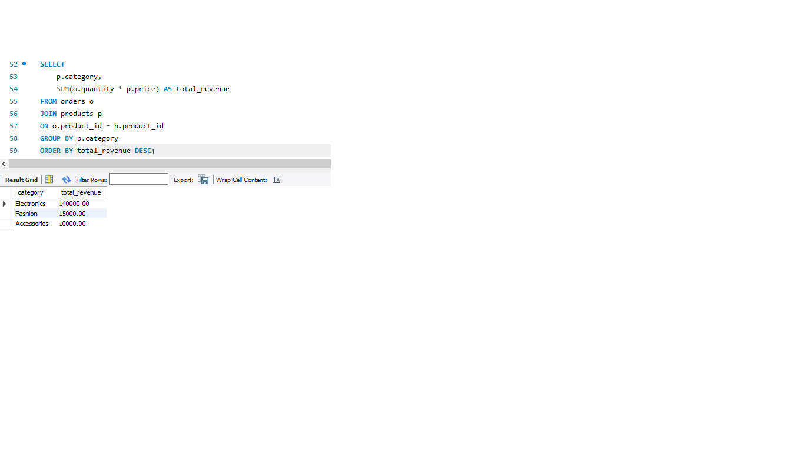
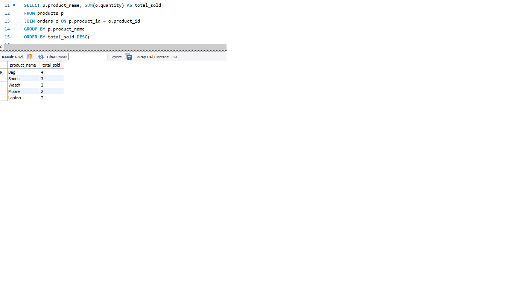

# Retail Sales Analysis using SQL

## Project Overview
This project analyzes retail sales data using SQL to identify customer purchasing behavior, sales trends, and category-wise revenue performance.

## Objectives
- Analyze customer spending patterns
- Identify top-selling products
- Generate monthly sales reports
- Evaluate category-wise revenue
- Practice SQL business reporting queries

## Tools Used
- MySQL
- SQL
- GitHub

## Database Tables
1. Customers
2. Products
3. Orders

## SQL Concepts Used
- INNER JOIN
- GROUP BY
- ORDER BY
- Aggregate Functions
- Subqueries
- Views

## Sample Query

```sql
SELECT p.category,
SUM(o.quantity * p.price) AS total_revenue
FROM orders o
JOIN products p
ON o.product_id = p.product_id
GROUP BY p.category
ORDER BY total_revenue DESC;
```

## Key Insights
- Electronics category generated the highest revenue
- Customer spending trends were successfully analyzed
- Monthly sales reporting improved visibility into sales performance

## Project Screenshots

### Revenue by Category


### Top Products


## Project Outcome
This project demonstrates practical SQL skills for retail business analysis and reporting.
